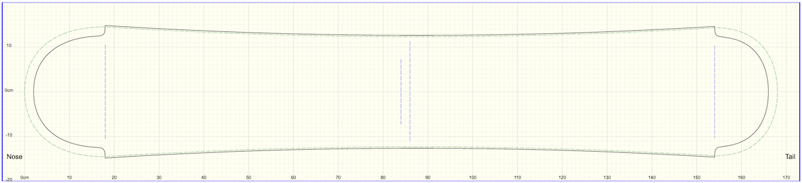

## Mikemag's Stuff

An overview of my public stuff on GitHub.

You can see all of the source for these pages at https://github.com/mikemag/mikemag.github.io

## CS Education

I have a small repository called [CS-Education](https://github.com/mikemag/CS-Education) of projects and code examples related to TEALS and voluenteering to help high school students learn computer science. There's samples in both C++, for the intro class, and Java for the AP CS A class.

### CS Videos

I've started trying to create short videos explaining some concepts in CS that I think would benefit from a bit of animation. I've started with one topic based on what I saw in the AP CS class recently and am branching out from there.

Check it all out here: [CS Videos](cs-videos.md)

## Ski and Snowboard Building

I have two repositories related to ski and snowboard building.

### MonkeyCAM

[MonkeyCAM](https://github.com/mikemag/MonkeyCAM) is an open source CAD/CAM program for designing skis and snowboards, and generating G-code programs to cut board parts with a CNC machine. It's a command line tool written in C++, with a React website wrapped around it. You can see site and play with the tool at https://monkeycam.org. 

### snoCAD-X

[snoCAD-X](https://github.com/mikemag/snoCAD-X) is an open source CAD program for designing skis and snowboards. It was written by Dan Graf of Graf Snowboards in 2007 and has been widely used since then. In 2014 it was open sourced in order to allow the greater ski and snowboard bulding community to carry it forward.

### phpBB

I have [a fork of phpBB 3](https://github.com/mikemag/phpbb) which is the forum software running at http://www.skibuilders.com/phpBB2/. It contains just a few changes to make the header look like the old site, and to give a bit more clarity to what size images you can upload.
